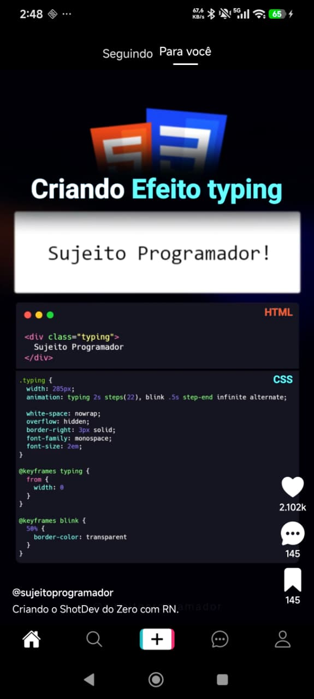

# TiktokApp Clone

A ideia desse projeto foi somente um estudo na aplicação de algumas técnicas, no caso:

- Listagem e reprodução de vídeo
- Utilização de TailwindCSS
- Testes unitários

A tela home do aplicativo é inspirada na interface do aplicativo TikTok.

## Créditos

Projeto desenvolvido com base e inspiração no vídeo: [React Native Tiktok Clone](https://www.youtube.com/watch?v=dGZZXQJAwA4)

## Preview da Tela Inicial



## Como rodar o projeto

Primeiro, você precisará iniciar o **Metro**, o servidor de desenvolvimento do React Native.

```sh
npm start
# ou
yarn start
```

Com o Metro rodando, abra uma nova janela de terminal e rode o aplicativo:

### Android

```sh
npm run android
# ou
yarn android
```

### iOS

Para iOS, lembre-se de instalar as dependências do CocoaPods antes:

```sh
bundle install
bundle exec pod install
```

E então rode:

```sh
npm run ios
# ou
yarn ios
```
